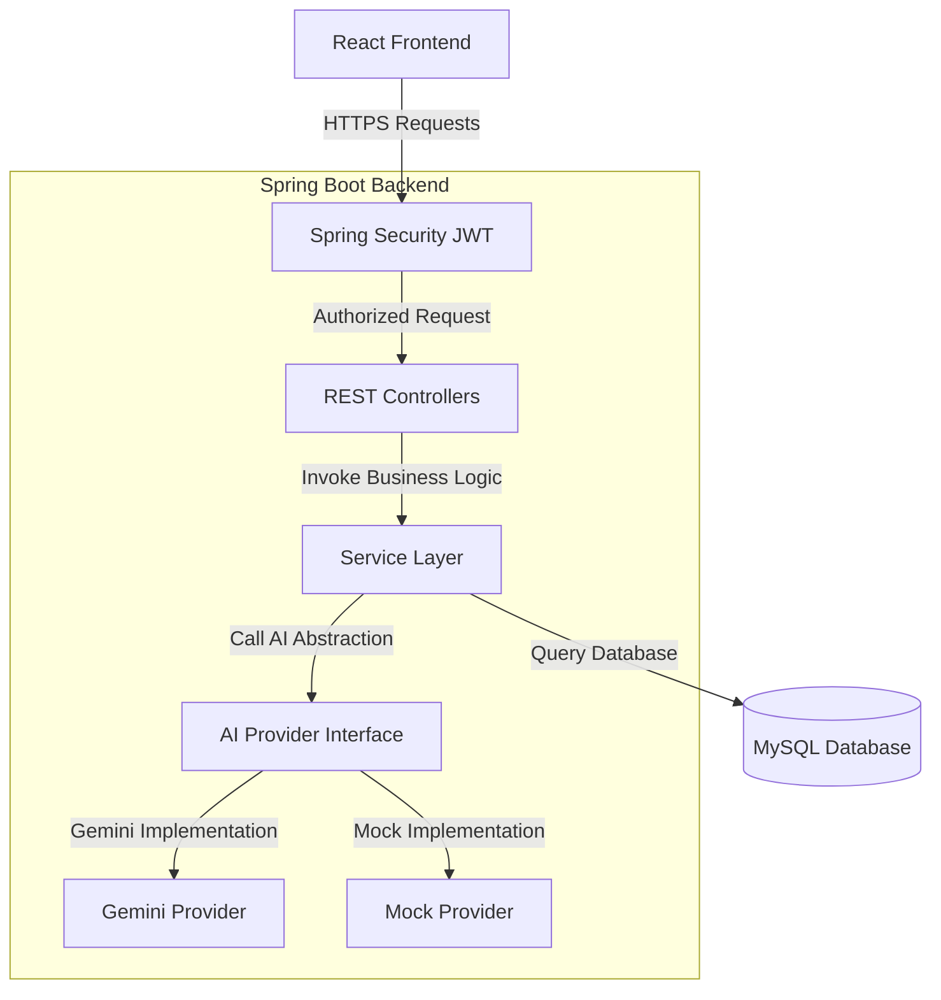

#  AI Academic Assistant

[](https://openjdk.org/)
[](https://spring.io/projects/spring-boot)
[](https://react.dev/)
[](https://opensource.org/licenses/MIT)

An enterprise-grade, full-stack AI-powered coaching companion designed for students, teachers, and academic administrators. Built with a clean, decoupled architecture, SOLID design principles, secure JWT session rotation, and a modular AI interface layer.

---

##  Key Features

*   Secure Multi-Role Authentication System
    *   Stateful JWT Access token rotation (1-hour expiry) and single-use Refresh tokens (7-day rotation) preventing replay attacks.
    *   Password cryptography hashing with `BCrypt`.
    *   Email verification simulation, secure password recovery flows, and clean session logout.
*   Interactive Student Dashboard
    *   A responsive drag-and-drop dropzone supporting `PDF`, `DOCX`, `TXT`, and image files with          active upload progress tracking.
    *   Asynchronous background grading simulation running under Spring `@Async` threads to evaluate drafts.
    *   Automated polling that updates dashboard KPIs and historical performance line charts (via Chart.js) when background tasks resolve.
*   AI Writing Coach & Assistant
    *   **Grammar Checker**: Identifies spelling and syntax errors, displaying character offsets and detailed pedagogical explanations (acting as an writing coach) with a one-click apply suggestion feature.
    *   **Context Rewriter**: Rephrases paragraphs to match Academic, Professional, Creative, or Simplified tones side-by-side.
    *   **Summarizer**: Compiles long papers into Short, Medium, or Bullet-point summary take-aways.
*   Accessible Design System
    *   Glassmorphism card layouts, light/dark modes, and modular styling.
    *   Keyboard navigation support (Esc modal closes, Tab cycles) and strict ARIA descriptors.

---

##  Tech Stack Matrix

| Layer | Technology | Key Purpose |
| :--- | :--- | :--- |
| **Frontend** | React 19, Vite, Tailwind CSS, Lucide icons | SPA interface, accessible inputs, layouts |
| **Animation** | Framer Motion | Smooth springs, tabs transitions, dropzone overlays |
| **Visuals** | Chart.js, react-chartjs-2 | Submission grade trends line charts |
| **Backend** | Java 21, Spring Boot 3.3.4 | Core REST API gateway |
| **Security** | Spring Security, JWT, BCrypt | Authorization filters, role routes, session locks |
| **Database** | MySQL, Hibernate, JPA | Relational audits, schemas, repositories |
| **Diagnostics** | Spring Boot Actuator, Prometheus | Application health metrics and health status |
| **AI Layer** | Google Gemini 1.5 Flash API | Decoupled LLM integration with JSON Schema validation |
| **Testing** | JUnit 5, MockMvc, Mockito | Isolated H2 database testing cycles |

---

##  System Architecture

The blueprint below displays the clean, decoupled flow of data from React clients through JWT security interceptors to database repositories and modular AI adapters.



---

##  Standardized API Endpoints

###  Authentication System (`/api/v1/auth`)

*   `POST /api/v1/auth/signup` - Registers a new user (Student, Teacher, Admin).
*   `POST /api/v1/auth/login` - Authenticates credentials and returns JWT Access & Refresh tokens.
*   `POST /api/v1/auth/verify-email` - Verifies newly registered accounts via token.
*   `POST /api/v1/auth/forgot-password` - Simulates sending password recovery emails.
*   `POST /api/v1/auth/reset-password` - Updates account credentials with valid reset tokens.
*   `POST /api/v1/auth/refresh` - Consumes and rotates valid Refresh tokens, returning new key sets.
*   `POST /api/v1/auth/logout` - Securely terminates active sessions and clears tokens.

###  Document & Grading System (`/api/v1/documents`)

*   `POST /api/v1/documents/upload` - Uploads assignment document, saving it locally and scheduling background evaluations.
*   `GET /api/v1/documents` - Fetches a paginated checklist of documents uploaded by the user.
*   `GET /api/v1/documents/stats` - Compiles KPIs (Total Uploads, Average Grade, Completed vs Pending status counts).
*   `GET /api/v1/documents/{id}` - Retrieves details and score outcomes of a single file.
*   `GET /api/v1/documents/{id}/download` - Streams the original file resource back to the client.

###  Writing Assistant System (`/api/v1/ai`)

*   `POST /api/v1/ai/grammar` - Performs grammar audits, returning corrections and rule justifications.
*   `POST /api/v1/ai/rewrite` - Rephrases original texts matching target tone settings.
*   `POST /api/v1/ai/summarize` - Summarizes long texts matching requested lengths.

---

##  Environment Variables

Copy the `.env.example` configurations to run in production:

### Backend Environments (`backend/.env`)
*   `SPRING_PROFILES_ACTIVE`: Active profile (e.g. `test` to run JUnit offline H2 databases, or `prod` for MySQL).
*   `SPRING_DATASOURCE_URL`: JDBC connector coordinates.
*   `SPRING_DATASOURCE_USERNAME` / `SPRING_DATASOURCE_PASSWORD`: Database credentials.
*   `APP_JWT_SECRET`: Secure 256-bit signature secret key.
*   `APP_GEMINI_API_KEY`: API key for Gemini models.

### Frontend Environments (`frontend/.env`)
*   `VITE_API_BASE_URL`: Base gateway URL of the Spring Boot REST API (`http://localhost:8080`).

---

##  Installation & Setup

### Prerequisites
*   **Java**: JDK 21 (Set `JAVA_HOME`)
*   **Node.js**: v20+ & npm
*   **MySQL**: Active local instance

### 1. Backend Setup
1.  Initialize database:
    ```sql
    CREATE DATABASE academic_assistant;
    ```
2.  Navigate to `backend` and copy example environments:
    ```bash
    cd backend
    cp .env.example .env
    ```
3.  Run unit & integration mock test suites:
    ```bash
    ./mvnw clean test
    ```
4.  Launch the Spring Boot server:
    ```bash
    ./mvnw spring-boot:run
    ```
    The server starts on port `8080`.

### 2. Frontend Setup
1.  Navigate to `frontend` and install packages:
    ```bash
    cd frontend
    npm install
    ```
2.  Copy example environments:
    ```bash
    cp .env.example .env
    ```
3.  Launch Vite development server:
    ```bash
    npm run dev
    ```
    The UI loads at `http://localhost:5173`.

---

##  Roadmap

*   [x] **Phase 1: Project Setup + Authentication + Database**
    *   API response wrapper, request-ID MDC tracing, JWT rotation, database layouts, and shared design system components.
*   [x] **Phase 2: Dashboard + File Upload**
    *   Drag-and-drop dropzone uploads, local storage service abstraction, `@Async` background grading simulation, stats KPIs, and historical Grade Line Charts.
*   [x] **Phase 3: AI Grammar, Rewrite, Summary**
    *   Decoupled `AiProvider` adapter, Gemini API JSON validation check, activity logs audit trail, input size controls, and Writing Coach UI panels.
*   [ ] **Phase 4: Formatting Checker + Assignment Score**
    *   Review font size, face, alignment, and page margins compliance checks.
*   [ ] **Phase 5: College Template Validator**
    *   Compare doc styles side-by-side with college formats.
*   [ ] **Phase 6: Teacher/Admin Panels**
    *   Submission dashboard reviews and user control grids.
*   [ ] **Phase 7: Reports, Notifications, AI Chat**
    *   Exporting evaluation PDF files and WebSocket notifications.
*   [ ] **Phase 8: Testing, Docker, Deployment, Documentation**
    *   Docker compose configs and GitHub Actions pipelines.

---

##  License

Distributed under the MIT License. See `LICENSE` for more information.
